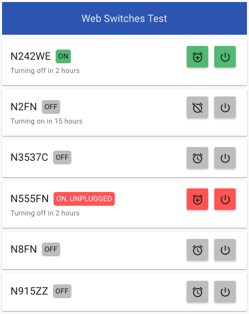

#Flying Neutrons
## Remote Control Engine Heaters

This application allows you to turn the engine block heaters for the airplanes on and off remotely.  You can set a timer for when they come on, and see whether they're plugged in; and heaters will turn off automatically after two hours.

### How it works
In the winter, the engine block heaters are always plugged in, but instead of being plugged in directly to the outlet, they are plugged into a "smart" switch that can be turned on and off remotely.

If you are at the airport, you can turn the heater on by pressing the button on top of the switch.  The blue light means the switch is on.  It will turn off automatically after two hours.

### How to use it
To use the application, go to [http://fnllc-heaters.herokuapp.com](http://fnllc-heaters.herokuapp.com).  *(NOTE: Once the link is available on the website, I'll change this.)*  You'll be asked to login with the username and password that you use for Schedule Master.

You'll see a list of all the airplanes, and the status of each.

| Button | Purpose |
|:-------------:| ------------- |
|  | Click to turn the heater on (or off, if it's already on). |
|  | Click to set a timer to turn the heater on.  A popup will ask you what time you want it to turn on.  Enter the time and click SET. |
|  | This button will show up if there is a timer set to turn the heater on.  Click the button to cancel the timer. |
|  | Click to keep the heater on longer if it's about to turn off. |

If an airplane says it is ON, but UNPLUGGED, that means that either the airplane is not there, or the heater is not plugged into the smart switch.  In this case you'll need to call the FBO or go to the airport yourself to make sure it is plugged in.

### Questions/comments
If you have any questions, feel free to e-mail [fnllc-smartthings@googlegroups.com](mailto:fnllc-smartthings@googlegroups.com).